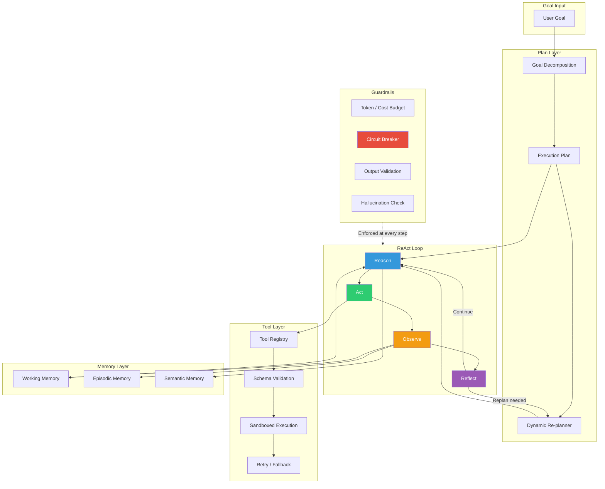
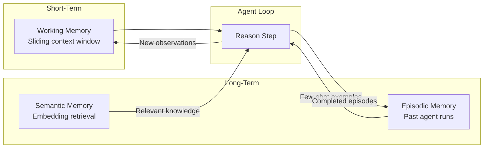
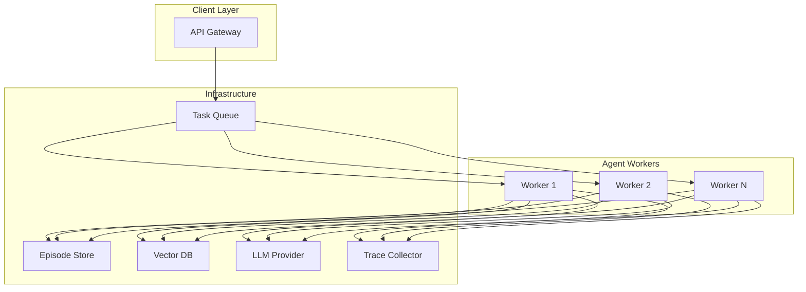

# agent-orchestrator

Production-grade AI agent orchestration framework — ReAct loops, tool dispatch, goal decomposition, memory management, and guardrails. Built for teams that need agents to be reliable, not just capable.

Written in TypeScript because agents live in the application layer, type safety prevents the subtle bugs that compound across agent steps, and the JavaScript ecosystem has the broadest tool integration surface.

## What's Inside

```
agent-orchestrator/
├── src/
│   ├── index.ts                    # Framework entry point
│   ├── core/
│   │   ├── agent.ts                # Agent lifecycle and execution loop
│   │   ├── planner.ts              # Goal decomposition and plan generation
│   │   ├── executor.ts             # Step execution with retry and fallback
│   │   └── types.ts                # Core type definitions
│   ├── reasoning/
│   │   ├── react-loop.ts           # ReAct (Reason + Act) implementation
│   │   ├── reflection.ts           # Self-evaluation and course correction
│   │   └── chain-of-thought.ts     # Structured reasoning traces
│   ├── tools/
│   │   ├── registry.ts             # Tool registration and dispatch
│   │   ├── schema.ts               # Tool input/output schema validation
│   │   └── builtin/
│   │       ├── web-search.ts       # Web search tool
│   │       ├── calculator.ts       # Math evaluation tool
│   │       └── code-executor.ts    # Sandboxed code execution
│   ├── memory/
│   │   ├── working-memory.ts       # Short-term context window management
│   │   ├── episodic-memory.ts      # Long-term episode storage and retrieval
│   │   └── semantic-memory.ts      # Embedding-based knowledge retrieval
│   ├── guardrails/
│   │   ├── validator.ts            # Output validation and safety checks
│   │   ├── budget.ts               # Token and cost budget enforcement
│   │   └── circuit-breaker.ts      # Failure detection and agent termination
│   └── observability/
│       ├── tracer.ts               # Step-level execution tracing
│       └── metrics.ts              # Agent performance metrics
├── tests/
│   ├── react-loop.test.ts
│   ├── tool-registry.test.ts
│   └── guardrails.test.ts
├── examples/
│   └── research-agent.ts           # Example: multi-step research agent
├── package.json
├── tsconfig.json
└── vitest.config.ts
```

## Architecture



### Agent Loop (ReAct)

The agent follows a **Reason > Act > Observe > Reflect** loop:

1. **Reason** - given the goal and current context, decide what to do next
2. **Act** - execute a tool call or generate a response
3. **Observe** - evaluate the result and update working memory
4. **Reflect** - periodically assess progress and adjust the plan

Each loop iteration is a discrete, logged, and reversible step.

### Goal Decomposition

Complex goals are broken into sub-tasks:

- **Hierarchical planning** - top-level goal decomposes into ordered sub-goals
- **Dependency tracking** - sub-tasks declare what they need and what they produce
- **Dynamic re-planning** - plan adjusts when a step fails or new information arrives
- **Parallel execution** - independent sub-tasks execute concurrently

### Tool System

- **Schema-validated** - every tool declares its inputs and outputs with Zod schemas
- **Sandboxed** - tool execution is isolated; failures don't crash the agent
- **Retryable** - configurable retry policies per tool (exponential backoff, fallback)
- **Composable** - tools can call other tools through the registry

### Memory Architecture



- **Working memory** - sliding window of recent context (conversation + tool results)
- **Episodic memory** - past agent runs stored for few-shot learning
- **Semantic memory** - embedding-based retrieval of relevant knowledge chunks

### Guardrails

- **Token budget** - hard cap on total tokens consumed per agent run
- **Cost budget** - dollar-denominated limit on LLM API spend
- **Circuit breaker** - automatic termination after N consecutive failures
- **Output validation** - every agent response checked against safety rules
- **Hallucination detection** - flag claims that contradict tool observations

## Architecture Decisions & Trade-offs

| Decision | Choice | Alternative Considered | Rationale |
|----------|--------|----------------------|-----------|
| Language | TypeScript | Python, Go | Agents are application-layer code. Type safety catches the subtle interface mismatches that compound across multi-step execution. Python's dynamic typing is a liability when agent outputs feed into tool inputs across dozens of steps. |
| Agent pattern | ReAct | Plan-and-Execute, Tree of Thought | ReAct balances reasoning quality with implementation simplicity. Plan-and-Execute front-loads planning but can't adapt mid-execution. Tree of Thought adds latency that's rarely justified outside research benchmarks. |
| Tool validation | Zod schemas | JSON Schema, runtime checks | Zod gives compile-time type inference plus runtime validation in one declaration. JSON Schema requires separate type generation. Runtime-only checks miss errors until production. |
| Memory model | Three-tier (working + episodic + semantic) | Single context window | Single context windows hit token limits fast. Three-tier memory lets agents reference relevant history without carrying everything in context. The cost is retrieval latency (~50ms) which is negligible against LLM inference time. |
| Error strategy | Circuit breaker + retry | Unlimited retry, fail-fast | Unlimited retry burns budget on unrecoverable failures. Fail-fast loses recoverable work. Circuit breaker gives N attempts before stopping - enough for transient failures, bounded for permanent ones. |
| Observability | Built-in tracing | External APM only | Agent debugging requires step-level traces that standard APM tools don't capture. Every reasoning step, tool call, and memory retrieval is logged as a structured span. External APM integration is additive, not a replacement. |

## Production Deployment



**Scaling model**: Agent workers are stateless consumers pulling from a task queue. Each worker manages its own ReAct loop, memory retrieval, and tool execution. Horizontal scaling is adding workers.

**Cost control**: Every agent run has a hard token and dollar budget. Circuit breakers terminate runaway agents. In production, the median agent run costs $0.02-0.08 depending on task complexity. Budget enforcement prevents the $50 agent run that does nothing useful.

**Failure modes addressed**:
- **LLM provider outage**: Retry with exponential backoff, fallback to secondary provider
- **Tool timeout**: Per-tool timeout with graceful degradation (agent continues without that tool's output)
- **Infinite loop**: Step counter + reflection checkpoints detect circular reasoning
- **Budget exhaustion**: Hard stop with partial result return and human escalation

## Quick Start

```bash
npm install
npm run build
npm test

# Run the example research agent
npm run example:research -- --goal "Compare the top 3 vector databases for production RAG"
```

## Design Principles

1. **Reliability over capability** — a 95% success rate per step drops to 60% over 10 steps
2. **Observable by default** — every reasoning step is traced and exportable
3. **Fail fast, fail loud** — agents should stop and ask rather than hallucinate
4. **Type everything** — if the agent's output isn't typed, it's a bug waiting to happen
5. **Budget-aware** — unbounded agent loops are production incidents

## The Compounding Error Problem

The central challenge of autonomous agents is **compounding errors**. Each decision point has a probability of failure, and these probabilities multiply:

| Steps | 95% accuracy | 90% accuracy |
|-------|-------------|-------------|
| 5     | 77%         | 59%         |
| 10    | 60%         | 35%         |
| 20    | 36%         | 12%         |

This framework addresses compounding errors through:
- **Reflection checkpoints** — periodic self-evaluation catches drift early
- **Plan adjustment** — re-plan when observations diverge from expectations
- **Guardrails** — hard stops before the agent goes off the rails
- **Human-in-the-loop** — configurable escalation points for uncertain decisions

## Background

Built from experience shipping AI-powered products and understanding that the hard part of agents isn't the LLM — it's the orchestration, error handling, and observability that make them production-ready. Every guardrail in this framework exists because its absence caused a real failure.

## License

MIT
